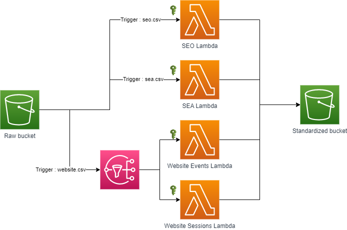

# How to write modules with conditional dynamic elements

When writing code, the DRY principle is one of the first ones that we are taught to respect. Terraform modules aim to do just that : package repeatable code so that you, as the coder, Don't Repeat Yourself.

Here is the architecture for this project :

# To do
1. Match code (TF + lambda) to architecture
2. Update V0 code to match to show the difference in size
3. Reread lessons and update

With this simple example, my aim is to show you the power of Terraform (TF) modules, when you know how to use them appropriately. Here are my five pieces of advice for programmers who are starting out.

# 1. As your architecture grows, create modules for repetitive blocs
When I first started using Terraform, I thought that it was brilliant. No need to go into the console and spend time clicking on options when I could easily define them through simple TF code. As my architecture grew, I started to notice some patterns in the definition of my resources. Given that I had several data transformation pipelines that were rather similar but had different code for the different data transformations, 

# 2. Create modules as you go
While it is recommended for versioning purposes, modules do not have to be published in a repo seperate from your project. As you are adding elements to your architecture, create a 'modules' directory to group relevant resources together as you go. Once you start to have a significant amount of modules and you would like to use different versions, create a seperate repo for these modules.

Why use different versions of modules ? If you would like to evolve your module but it is currently being used in production, you can tag the commit used in production and continue to use that module version for those resources. Meanwhile, you can continue development on your module and test it on a development environement. Once it is ready, you update the module version for the production environement, thus reducing the risk. 

# 3. Group your resources based on resources that are always deployed together
During the development of these modules, I wondered if the s3 bucket notifications should go in the lambda function module or the s3 bucket module. While each of the notifications were attached to a specific lambda function, all s3 notifications needed to be deployed at once, otherwise they would overwrite each other. As a result, the logical grouping was to have the s3 notifications grouped with the s3 buckets, even if conceptually that seemed backawrds, since I defined the buckets and lambdas first and went back to add the s3 notifications

# 4. Take advantage of for loops and conditionals
Once I decided which resources to group together, I noticed that within several resources, I had several repeating blocs, most notably in the s3 notifications. Creating a for_each to loop through a list of my various s3 bucket notifications was easy. But what about when I include another type of notification : sns_topics ? How do I take care of a case where I have one bucket with only s3 notifications and another with both s3 and sns notifications ? What about buckets that don't have any notifications ? How do I deal with sns notifications that require only one bloc for the notifications but multiple lambda permissions ? How do I create simple, logical and error proof variables ? (i.e. not having to repeat a list of lambdas for the sns notifications and a dictionnary for the lambda permissions)

I often find that when I have a tech issue, I try to forsee all of the issues that I will have. In those moments, I break down my problem and try to solve a small issue at a time. After a couple iterations, I find that the problem has been resolved with no major concerns. As a result, before spinning out of control, I started tackling the different questions, one by one, starting with the quick wins. This approach relies heavily on testing as you go to ensure that one question is answered correctly before going on to the next, in order to avoid a whole list of errors at a time.

After I created and tested the for_each for the s3 notifications. I tried creating the sns notifications. They were a bit more complicated because they did not have a one to one s3-lambda relationship. As a result, I could not have a simple list. I needed to use something like a dictionnary with the lambdas as the keys and sns topic as the value. After a bit of trial and error, that question was answered as well.

Once the seperate elements were answered, I came to the question that worried me the most : how do I tell TF to deploy an s3 bucket with no notifications but also an s3 bucket with only s3 notifications and a third bucket with both types of notifications ? Again, I took a breath and instead of worrying for no reason, I started to test different options.

# 5. Get creative but remain simple
Finding a way to include a conditional bloc with a repeating element stumped me at the begining. How would that be possible when I couldn't use both a *for_each* and a *count* statement within my resource specification. As always, I turned to the power of the collective mind : Google. Reading through a couple peoples' problems, I combined multiple replies to come up with the conditional for_each statement. Initially, I was worried that it would not work because I figured that Terraform would still try to create a resource even if the input each.value is empty. Instead of worrying about that, I tested it. 

## Special thanks
*Shout out to Yevgeniy Brikman who wrote the two most useful Terraform module articles (see PDFs) that I have read.*